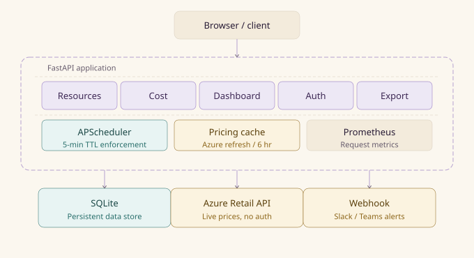

# ☁️ Cloud Resource Lifecycle Manager

[](https://cloud-resource-manager-n2f4.onrender.com/dashboard/ui)
[](https://cloud-resource-manager-n2f4.onrender.com/docs)
[](https://github.com/ad-kat/cloud-resource-manager/actions)

A production-patterned REST API for managing cloud resource lifecycles : with **live Azure pricing**, automated governance, cost forecasting, and a real-time dashboard. Built with FastAPI, SQLite, Docker, and deployed on Render.

---

## What it solves

Companies lose thousands of dollars monthly on forgotten cloud resources : VMs nobody uses, databases nobody queries, buckets full of stale test data. This system tracks every resource's lifecycle, enforces TTL-based auto-stop policies, projects monthly costs by department, and alerts when budgets are exceeded. The same patterns are used in production FinOps tools like Kubecost and Infracost.

---

## Features

**Live Azure pricing** : fetches real hourly rates from the Azure Retail Pricing API on startup (free, no account or API key required). Cached for 6 hours with static fallback if unreachable. No more hardcoded fake rates.

**Resource lifecycle management** : create, update, and deprovision cloud resources (VM, bucket, function, database) with full state tracking across four states: `provisioning → active → stopped → deprovisioned`.

**TTL enforcement** : a background APScheduler job runs every 5 minutes and automatically stops any resource that has exceeded its configured TTL. No human intervention required.

**Audit trail** : every state change is written to an `events` table with timestamp, actor, and action. Full history for security, billing disputes, and compliance.

**Cost forecasting** : `GET /cost/forecast` uses numpy linear regression on historical resource creation patterns to project 7/30/90-day spend scenarios, broken down by cost-centre.

**Budget alerts** : set monthly limits per cost-centre. The system calculates utilisation and fires webhook alerts (Slack, Teams, Discord) when approaching or exceeding limits.

**Real-time dashboard** : Chart.js doughnut and bar charts showing resource breakdown by type and status, projected monthly cost by cost-centre, a 90-day forecast line chart, budget alert panel, and audit event feed. Auto-refreshes every 30 seconds. Light/dark theme toggle.

**Chargeback reports** : `GET /cost/by-cost-centre` groups spend by department tag for finance teams.

**Prometheus metrics** : request counts and latency exposed at `/metrics` for observability tooling.

---

## Architecture Diagram


---

## Tech stack

| Layer | Tool |
|---|---|
| Framework | FastAPI (Python 3.12) |
| Database | SQLite (Postgres supported via `DATABASE_URL` env var) |
| Background jobs | APScheduler |
| Cost forecasting | NumPy linear regression |
| Dashboard | Chart.js via CDN |
| Metrics | Prometheus via FastAPI instrumentator |
| Containerisation | Docker + docker-compose |
| Deployment | Render (free tier) |

---

## API endpoints

| Method | Path | Description |
|---|---|---|
| `POST` | `/resources/` | Provision a new resource |
| `GET` | `/resources/` | List all resources |
| `GET` | `/resources/{id}` | Get a specific resource |
| `PATCH` | `/resources/{id}/policy` | Update status or tags |
| `DELETE` | `/resources/{id}` | Deprovision a resource |
| `GET` | `/cost/rates` | Current live Azure pricing rates |
| `GET` | `/cost/estimate/{id}` | Cost accrued + projected monthly for one resource |
| `GET` | `/cost/by-cost-centre` | Chargeback report grouped by department |
| `POST` | `/cost/budgets` | Set monthly budget for a cost-centre |
| `GET` | `/cost/budgets/alerts` | Active budget threshold alerts |
| `GET` | `/cost/forecast` | 7/30/90-day cost projection with linear regression |
| `GET` | `/dashboard/ui` | Live HTML dashboard with charts |
| `GET` | `/dashboard/` | Dashboard JSON snapshot |
| `GET` | `/export/cost-report` | CSV cost report export |
| `GET` | `/export/audit-log` | CSV full audit log export |
| `GET` | `/metrics` | Prometheus metrics endpoint |
| `GET` | `/health` | Health check |

---

## Running locally

```bash
git clone https://github.com/ad-kat/cloud-resource-manager
cd cloud-resource-manager
docker compose up --build
```

Visit `http://localhost:8000/dashboard/ui` for the live dashboard.  
Visit `http://localhost:8000/docs` for the interactive Swagger UI.

No Postgres or external services required : SQLite runs automatically.

---

## Configuration

| Variable | Default | Description |
|---|---|---|
| `DATABASE_URL` | `sqlite:///./resources.db` | SQLite (default) or Postgres connection string |
| `ALERT_WEBHOOK_URL` | _(unset)_ | Slack/Teams/Discord webhook for budget alerts |

---

## Design decisions

**SQLite over Postgres** : eliminates external dependencies for local development and free-tier deployment. Postgres is supported by switching `DATABASE_URL`... the rest of the codebase is unchanged. In production you'd use managed Postgres or Aurora.

**Azure Retail API over AWS** : the Azure pricing API is completely public (no account, no API key, small filtered JSON responses). AWS pricing JSON is 500MB+, which crashes free-tier deployments.

**APScheduler over a cron job** : runs inside the same process as the API, keeping the deployment a single container with no external scheduler dependency.

**Numpy forecasting** : uses `polyfit` on cumulative resource counts to estimate growth rate, then projects spend forward. Simple, dependency-light, and explainable.

---

## Project structure

```
app/
├── main.py          : FastAPI app, startup lifecycle
├── database.py      : SQLAlchemy engine, schema init, SQLite/Postgres support
├── models.py        : Pydantic request/response schemas
├── pricing.py       : Azure Retail API integration, rate cache
├── scheduler.py     : APScheduler TTL enforcement job
└── routers/
    ├── resources.py : Resource CRUD + policy enforcement
    ├── cost.py      : Cost estimation, budgets, forecasting
    ├── dashboard.py : HTML dashboard + JSON snapshot
    ├── auth.py      : JWT authentication
    ├── export.py    : CSV exports
    └── metrics.py   : Prometheus instrumentation
```